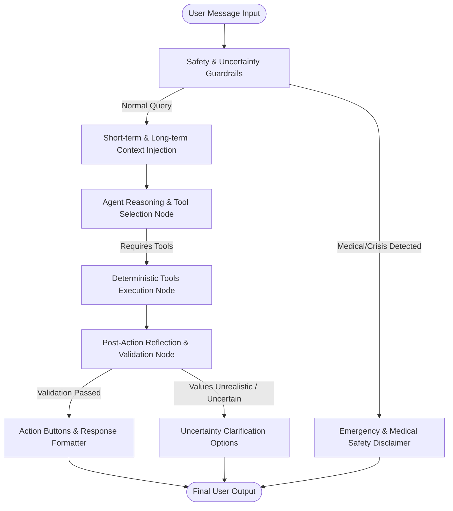

# AI Agent Architecture & Tools Reference

## LangGraph Multi-Turn Nutrition Agent

---

## 1. Agent Architecture & Execution Flow

The agent is implemented using **LangGraph** with a stateful computational graph consisting of tool-calling loops and an explicit **Post-Action Reflection and Validation Node**.

---

## 2. Post-Action Reflection and Validation Node

After tool execution, the execution state enters `_post_action_reflection_node`:
1. **Mathematical & Range Validation**:
   - Ensures no calorie numbers are negative or implausibly high ($> 5,000 \text{ kcal}$ for a single meal).
   - Verifies macronutrient consistency:
     $$\text{Calculated Energy} \approx (4 \times \text{Protein}) + (4 \times \text{Carbs}) + (9 \times \text{Fat})$$
2. **Goal Impact Assessment**:
   - Calculates remaining daily allowances for calories, protein, carbs, fat, and fiber.
   - Computes whether the logged meal will place the user into a surplus, deficit, or target range.
3. **Uncertainty Quantification**:
   - Evaluates whether volume unit conversion used generic fallbacks ($\le 0.65$ confidence).
   - If confidence $< 0.70$, automatically sets `uncertainty_flag = true` and generates interactive multiple-choice portion options.
4. **Contextual Action Buttons**:
   - Generates quick-action chips for the mobile client (e.g. `log_meal`, `view_meals`, `clarify`, `ask_why`).

---

## 3. Reference of All 20 Deterministic Tools

| # | Tool Identifier | Purpose & Operation |
| :--- | :--- | :--- |
| 1 | `search_foods_tool` | Searches INDB, ICMR-NIN, and FCT databanks by keyword with match scoring. |
| 2 | `get_food_nutrients_tool` | Retrieves exact micro & macro composition per 100g and standard serving. |
| 3 | `convert_volume_to_grams_tool` | Uses `Units.xlsx` food-specific densities; tags fallbacks with confidence $\le 0.65$. |
| 4 | `calculate_recipe_nutrition_tool` | Computes recipe yield, cooked 100g densities, and per-serving macros (Method C). |
| 5 | `log_meal_tool` | Logs multi-item meal with user isolation and deterministic nutrition calculation. |
| 6 | `get_today_meals_tool` | Fetches today's breakfast, lunch, dinner, snacks and item details. |
| 7 | `delete_meal_tool` | Deletes a logged meal by ID with ownership verification. |
| 8 | `get_nutrition_goals_tool` | Retrieves user's personalized daily calorie and macronutrient targets. |
| 9 | `update_nutrition_goals_tool` | Modifies calorie, protein, carbohydrate, fat, or fiber targets. |
| 10 | `get_daily_analytics_tool` | Returns consumed vs target macros, progress percentages, and remaining goals. |
| 11 | `get_period_trends_tool` | Aggregates 7-day or 30-day nutrition history and daily trends. |
| 12 | `get_period_comparison_tool` | Compares today vs yesterday, this week vs last week, or this month vs last month. |
| 13 | `get_energy_balance_tool` | Computes Calories In vs Calories Out ($E_{balance} = C_{in} - C_{out}$). |
| 14 | `get_missing_meal_alerts_tool` | Identifies unlogged meals past their scheduled time respecting quiet hours. |
| 15 | `update_notification_settings_tool` | Configures meal reminder schedules, toggles, and quiet hours. |
| 16 | `save_user_memory_tool` | Persists user dietary habits, favorite recipes, or preferences into long-term memory. |
| 17 | `search_user_memory_tool` | Semantic search over stored user habits and preferences. |
| 18 | `suggest_foods_by_macro_tool` | Suggests authentic Indian foods meeting specific macro criteria (e.g. high protein). |
| 19 | `check_safety_guardrails_tool` | Detects medical diagnosis requests, eating disorders, or extreme deficits ($< 1,200 \text{ kcal}$). |
| 20 | `generate_clarification_tool` | Produces structured multiple-choice portion options when confidence is low. |

---

## 4. Safety Guardrails & Disclaimers

The agent enforces strict non-negotiable medical guardrails:
1. **No Medical Diagnosis**: The agent cannot prescribe medication, diagnose diabetes, hypertension, renal failure, or recommend therapeutic medical diets.
2. **Mandatory Medical Disclaimer**: Every advice response carries or links to the standard disclaimer:
   > *"This AI Nutrition Coach provides educational and nutritional guidance based on standard composition tables. It does not provide medical advice or diagnosis. Consult a physician or registered dietitian for medical conditions."*
3. **Severe Caloric Restriction Prevention**: Warns users if their targeted daily calorie goal is below $1,200 \text{ kcal/day}$ for adult females or $1,500 \text{ kcal/day}$ for adult males.
4. **Eating Disorder Safeguards**: Prompts seeking extreme fasting, purging, or dangerous deficits trigger crisis resource suggestions and a refusal to facilitate unsafe dietary restrictions.
