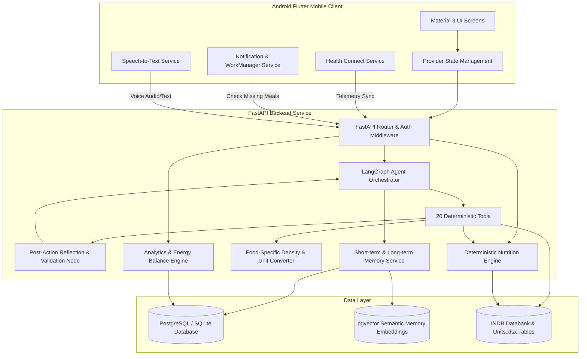

# System Architecture

## AI-Powered Personal Nutrition & Energy Balance Coach

---

## 1. Executive Architecture Overview

The system is designed as an enterprise-grade, mobile-first agentic nutrition ecosystem. It strictly decouples deterministic nutrition calculations from generative language modeling to prevent algorithmic hallucination and ensure medical/nutritional precision.

---

## 2. Layer Separation & Determinism Invariant

A foundational design invariant of this platform is:
> **Large Language Models (LLMs) must NEVER perform nutritional arithmetic, macro scaling, or energy balance calculations.**

All calculations are executed in deterministic Python services (`NutritionEngine` and `UnitConverter`) with $O(1)$ lookup guarantees from verified nutritional reference tables:
1. **Natural Language Input Parsing**: The LLM extracts candidate food names, raw quantities, and unit strings from user text or audio transcriptions.
2. **Deterministic Name Matching & Unit Conversion**: The candidate items are matched against the Indian Nutrient Databank (INDB). The `UnitConverter` looks up food-specific volumetric densities (e.g. 1 cup cooked dal = 240g, 1 cup cooked rice = 150g, 1 medium roti = 40g).
3. **Deterministic Formula Computation**:
   $$\text{Nutrient}_{\text{consumed}} = \text{Nutrient}_{100\text{g}} \times \frac{\text{Weight}_{\text{grams}}}{100}$$
4. **Post-Action Reflection & Validation**: The LangGraph reflection node validates the resulting numbers against physical sanity bounds ($0 \le \text{calories} \le 5000$), checks remaining daily targets, assesses confidence degradation, and appends clarification or disclaimer metadata.

---

## 3. Component Details

### 3.1 Mobile Client (Flutter / Android)
- **Framework**: Flutter 3.22+ targeting Android SDK 34 (Android 14) with minimum SDK 26 (Android 8.0).
- **Design System**: Material 3 Wellness palette:
  - Primary Sage: `#3F7D5A`
  - Deep Teal Accent: `#2F6547`
  - Cream Background: `#F7F8F3`
  - Dark Slate Surface: `#0D1410`
  - Semantic Macro Colors: Protein (Blue `#3B82F6`), Carbs (Amber `#F59E0B`), Fat (Coral `#EF4444`), Fiber (Emerald `#10B981`).
- **Telemetry Integration**: Native Android `Health Connect` API via platform channels, synchronizing active calories burned, basal metabolic rate (BMR), step counts, and active minutes.
- **Background Orchestration**: Android `WorkManager` triggers periodic wakeups (`every 15-30 minutes`) to query unlogged meal schedules against quiet hours, delivering high-priority notifications via `flutter_local_notifications`.

### 3.2 Backend Service (FastAPI / Python 3.11)
- **Framework**: FastAPI with asynchronous ASGI execution and strict Pydantic v2 schemas.
- **Agent Orchestrator**: LangGraph state machine maintaining state graphs across tool calls with human-in-the-loop clarification branching.
- **Post-Action Reflection Node**: Validates macro outputs, monitors remaining daily targets, verifies uncertainty level, and constructs structured UI action buttons.
- **Ingestion Pipeline**: Ingests 1,283 verified food compositions from INDB, UK FCT, US FCT, and ICMR-NIN 2017 staples, together with 282 density conversions from `Units.xlsx`.

### 3.3 Data Layer
- **Relational Storage**: PostgreSQL 16 (or SQLite for isolated development/testing) with normalized tables enforcing foreign key constraints and user isolation.
- **Semantic Vector Storage**: `pgvector` extension for long-term episodic and semantic user preference recall.
