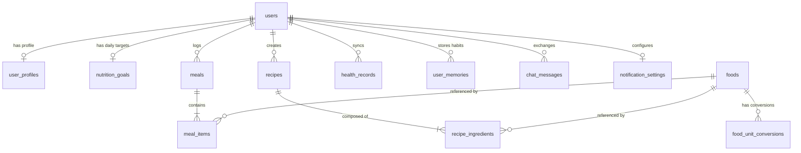

# Database Schema Documentation

## Relational & Vector Data Model

---

## 1. Entity-Relationship Diagram

---

## 2. Table Schemas & Definitions

### `users`
Primary authentication and identity entity.
- `id` (INTEGER, Primary Key, Auto-increment)
- `email` (VARCHAR, Unique, Indexed, NOT NULL)
- `hashed_password` (VARCHAR, NOT NULL)
- `full_name` (VARCHAR, NOT NULL)
- `is_active` (BOOLEAN, Default: true)
- `is_verified` (BOOLEAN, Default: false)
- `created_at` (TIMESTAMP WITH TIME ZONE, Default: NOW())
- `updated_at` (TIMESTAMP WITH TIME ZONE, Default: NOW())

### `user_profiles`
Biometric measurements and lifestyle configuration.
- `id` (INTEGER, Primary Key)
- `user_id` (INTEGER, Foreign Key to `users.id` ON DELETE CASCADE, Unique)
- `age` (INTEGER, Nullable)
- `gender` (VARCHAR, e.g. male, female, other)
- `height_cm` (FLOAT, Nullable)
- `weight_kg` (FLOAT, Nullable)
- `activity_level` (VARCHAR, e.g. sedentary, lightly_active, moderately_active, very_active)
- `dietary_preference` (VARCHAR, e.g. vegetarian, vegan, non_vegetarian, jain, eggetarian)
- `allergies` (JSONB / TEXT JSON)
- `food_preferences` (JSONB / TEXT JSON)

### `nutrition_goals`
Personalized daily targets.
- `id` (INTEGER, Primary Key)
- `user_id` (INTEGER, Foreign Key to `users.id` ON DELETE CASCADE, Unique)
- `calorie_target` (FLOAT, Default: 2000.0)
- `protein_g` (FLOAT, Default: 75.0)
- `carb_g` (FLOAT, Default: 250.0)
- `fat_g` (FLOAT, Default: 65.0)
- `fiber_g` (FLOAT, Default: 30.0)
- `water_ml` (FLOAT, Default: 2500.0)

### `foods`
Ground truth nutritional database populated from INDB, ICMR-NIN, and FCT.
- `id` (INTEGER, Primary Key)
- `food_code` (VARCHAR, Indexed, Nullable)
- `food_name` (VARCHAR, Indexed, NOT NULL)
- `category` (VARCHAR, Indexed, Nullable)
- `source` (VARCHAR, e.g. INDB_RECIPES, ICMR_NIN, UK_FCT, US_FCT)
- `serving_size` (FLOAT, Default: 100.0)
- `serving_unit` (VARCHAR, Default: 'g')
- `weight_g` (FLOAT, Default: 100.0)
- `energy_kcal` (FLOAT, NOT NULL)
- `protein_g` (FLOAT, NOT NULL)
- `carbohydrate_g` (FLOAT, NOT NULL)
- `fat_g` (FLOAT, NOT NULL)
- `fiber_g` (FLOAT, NOT NULL)
- `unit_serving_energy_kcal` (FLOAT, Nullable)

### `food_unit_conversions`
Food-specific volumetric density conversions from `Units.xlsx`.
- `id` (INTEGER, Primary Key)
- `food_id` (INTEGER, Foreign Key to `foods.id`, Nullable)
- `food_name` (VARCHAR, Indexed, NOT NULL)
- `unit` (VARCHAR, Indexed, e.g. cup, bowl, katori, tbsp, piece)
- `gram_weight` (FLOAT, NOT NULL)
- `confidence_score` (FLOAT, Default: 0.95)
- `is_food_specific` (BOOLEAN, Default: true)

### `recipes` & `recipe_ingredients`
Method C custom recipe builder entities with cooked yield.
- `recipes`: `id`, `user_id`, `name`, `description`, `category`, `servings_count`, `serving_unit`, `total_cooked_weight_g`, `calories_per_serving`, `protein_per_serving`, `carb_per_serving`, `fat_per_serving`, `fiber_per_serving`, `total_calories`, `is_system`, `created_at`.
- `recipe_ingredients`: `id`, `recipe_id`, `food_id`, `food_name`, `quantity`, `unit`, `weight_g`, `calories`, `protein`, `carbs`, `fat`, `fiber`.

### `meals` & `meal_items`
User meal logging entities.
- `meals`: `id`, `user_id`, `meal_type` (breakfast, lunch, dinner, snack), `logged_at` (TIMESTAMP), `total_calories`, `total_protein`, `total_carbs`, `total_fat`, `total_fiber`, `confidence_score`, `notes`, `created_at`.
- `meal_items`: `id`, `meal_id`, `food_id`, `recipe_id`, `item_name`, `quantity`, `unit`, `weight_g`, `calories`, `protein`, `carbs`, `fat`, `fiber`, `confidence_score`.

### `health_records`
Android Health Connect telemetry ingestion entity.
- `id`, `user_id`, `recorded_date` (DATE, Indexed), `total_calories_burned`, `active_calories_burned`, `steps`, `distance_m`, `active_minutes`, `resting_heart_rate`, `source`, `created_at`.

### `user_memories`
Long-term semantic and habit memory with vector embeddings.
- `id`, `user_id`, `memory_key`, `memory_value`, `category`, `importance_score`, `embedding` (`VECTOR(768)` or `TEXT JSON`), `created_at`.

### `notification_settings`
Proactive reminder schedules and quiet hours configuration.
- `id`, `user_id`, `reminders_enabled`, `quiet_hours_start` ("22:00"), `quiet_hours_end` ("07:00"), `breakfast_time` ("08:30"), `lunch_time` ("13:00"), `dinner_time` ("20:00"), `snack_time` ("17:00"), `breakfast_enabled`, `lunch_enabled`, `dinner_enabled`, `snack_enabled`.
