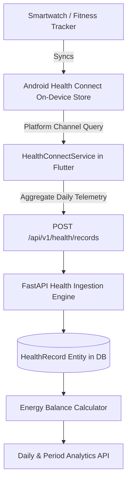

# Android Health Connect Integration & Energy Balance

---

## 1. Overview

The mobile application integrates natively with **Android Health Connect** (Android 14+ on-device framework or Android 9-13 via Google Play Services companion app) to securely synchronize physical activity, steps, active energy expenditure, and basal metabolic rate without relying on third-party cloud aggregators.

---

## 2. Permissions & Privacy Policy Rationale

### Android Manifest Permissions Requested
The application declares the following permissions in `mobile/android/app/src/main/AndroidManifest.xml`:

```xml
<!-- Health Connect Read Permissions -->
<uses-permission android:name="android.permission.health.READ_TOTAL_CALORIES_BURNED"/>
<uses-permission android:name="android.permission.health.READ_ACTIVE_CALORIES_BURNED"/>
<uses-permission android:name="android.permission.health.READ_STEPS"/>
<uses-permission android:name="android.permission.health.READ_DISTANCE"/>
<uses-permission android:name="android.permission.health.READ_EXERCISE"/>
<uses-permission android:name="android.permission.health.READ_RESTING_HEART_RATE"/>

<!-- Health Connect Rationale Intent Filter -->
<intent-filter>
    <action android:name="androidx.health.ACTION_SHOW_PERMISSIONS_RATIONALE" />
</intent-filter>
```

### User Permission Rationale (Displayed in Health Connect App)
> *"Nutrition & Energy Balance Coach requires read access to your steps, active calories burned, and total calories burned in order to deterministically compute your daily energy balance (Calories In vs Calories Out). Your health data is processed solely on your device and private backend instance, and is never sold or shared with third parties."*

---

## 3. Data Synchronization Architecture



### Telemetry Record Ingestion Schema
```json
{
  "recorded_date": "2026-09-21",
  "total_calories_burned": 2240.0,
  "active_calories_burned": 420.0,
  "steps": 8450,
  "distance_m": 6120.0,
  "active_minutes": 45,
  "resting_heart_rate": 68.0,
  "source": "health_connect"
}
```

---

## 4. Energy Balance Formulas & Status Determination

### Mathematical Definition
Daily Net Energy Balance is calculated as:
$$E_{\text{balance}} = C_{\text{in}} - C_{\text{out}}$$

Where:
- $C_{\text{in}}$: Total dietary calories consumed across all logged meals (breakfast, lunch, dinner, snacks).
- $C_{\text{out}}$: Total daily energy expenditure (TDEE). If Health Connect total calories burned is available, that measured value is used. If Health Connect is not available, TDEE is computed deterministically using the **Mifflin-St Jeor equation** multiplied by the user's activity multiplier:

$$\text{BMR}_{\text{male}} = 10 \times \text{weight (kg)} + 6.25 \times \text{height (cm)} - 5 \times \text{age (yr)} + 5$$
$$\text{BMR}_{\text{female}} = 10 \times \text{weight (kg)} + 6.25 \times \text{height (cm)} - 5 \times \text{age (yr)} - 161$$

### Balance Status Categorization
The status is categorized with a $\pm 100 \text{ kcal}$ maintenance band:
- **Deficit**: $E_{\text{balance}} < -100\text{ kcal}$ (Weight loss trajectory)
- **Maintenance**: $-100\text{ kcal} \le E_{\text{balance}} \le +100\text{ kcal}$ (Equilibrium)
- **Surplus**: $E_{\text{balance}} > +100\text{ kcal}$ (Hypertrophy / weight gain trajectory)
